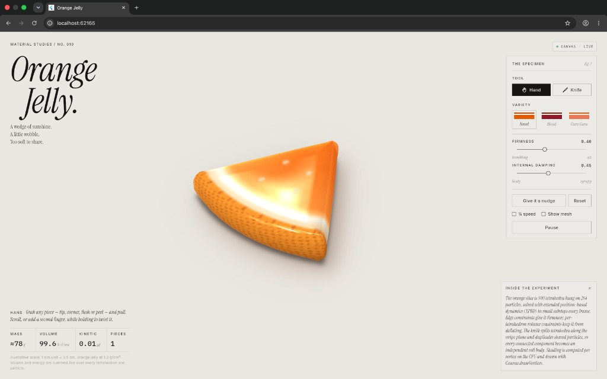
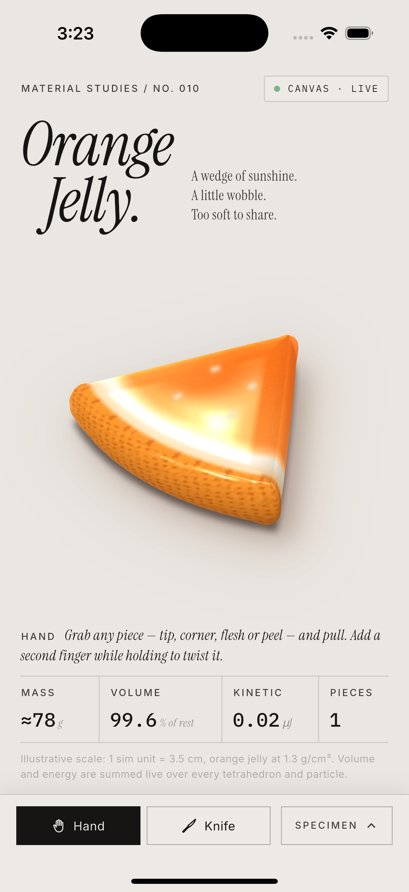

# Orange Jelly

A real-time soft-body orange slice you can grab, twist, and cut. Flutter app for Android, iOS, and web. The package name is `orangejelly`; the app title is **Orange Jelly**.

Material study no. 01. A wedge of sunshine. A little wobble. Too soft to share.





## What you can do

- **Hand.** Grab any part of the slice (tip, corner, flesh, or peel) and pull it. A second finger, or scroll while holding, twists the grabbed cluster. Letting go throws it.
- **Knife.** Draw a line across the slice. A cleaver lines up over the line while you drag. Nothing is cut until you let go. On release the blade chops down, the cut fires at impact, the pieces push apart, and the knife lifts away. Cut the pieces again, as small as you like. A short swipe only slits the geometry under the blade.
- **Nudge.** Pops every piece upward with a slightly off-centre impulse so it lands unevenly and wobbles.
- **Reset.** Restores the original single piece.
- **Pause / Resume.** Freezes the simulation. The knife animation keeps its own clock.
- **¼ speed.** Runs the jelly at a quarter of normal playback. Normal play is already 1.4× wall-clock so drops and bounces do not feel floaty. Quarter speed is `1.4 × 0.25`.
- **Show mesh.** Overlays the simulation wireframe.

### Varieties

| Variety | Look |
| --- | --- |
| **Navel** (default) | Bright orange flesh, white pith, dimpled peel, a few pale pips |
| **Blood** | Burgundy flesh, russet peel |
| **Cara Cara** | Salmon-pink flesh, warm orange peel |

Firmness runs from **trembling** to **set** (default `0.40`). Internal damping runs from **lively** to **syrupy** (default `0.45`). Both update the solver live.

### Live stats

Readouts refresh about 10 times a second, and only when a rounded value changes.

| Stat | Meaning |
| --- | --- |
| **Mass** | Rest volume × density. About **78 g** for the uncut slice |
| **Volume** | Current tetrahedron volume as a percent of rest. Holds near **99–100%** at rest |
| **Kinetic** | Sum of particle kinetic energy, in microjoules |
| **Pieces** | Connected soft bodies. Starts at **1** |

Scale used for those numbers: **1 simulation unit = 3.5 cm**, density **1.3 g/cm³**.

## Layout

- **Wide screens** (width ≥ 760, or landscape ≥ 560): side panel like the screenshot. Title and tagline on the left, jelly in the middle, **The Specimen** on the right, stats along the bottom.
- **Portrait phones:** controls collapse into a bottom sheet. Hand and Knife stay visible. The rest opens behind **SPECIMEN**. When the sheet opens, the camera recentres the jelly above it.
- Text scaling is capped at 1.2× so the layout holds together.
- The status chip reads **CANVAS · LIVE** (or **PAUSED**). Shading is CPU-side and drawn with Canvas, not WebGPU.

## How the jelly works

The slice is a 60° wedge, about 8.3 cm along the peel and 1.75 cm thick, built as a triangulated sector extruded into prisms. Each prism is split into tetrahedra:

- **264 particles**, **900 tetrahedra** on the uncut piece
- Positions live in flat `Float64List` buffers
- Top and bottom edges are bevelled. The renderer adds a pillow dome and rounded outline on top of that mesh, so the physics count stays fixed while the surface looks smooth

### Solver

Extended position-based dynamics (XPBD), one constraint iteration per substep, stiffness from many small substeps (target substep `1/600` s, clamped to a few dozen per frame).

- **Edge constraints** set firmness. The slider maps log-linearly onto edge compliance.
- **Tetrahedron volume constraints** keep the slice from deflating.
- Gravity, air drag, ground friction, a circular stage wall, and a ceiling for flung particles.
- **Internal damping** damps non-rigid wobble without killing falls and spins. The slider maps exponentially onto that rate.
- Separate pieces collide particle-to-particle.

### Cutting

The chop is a vertical plane along the drawn ground line, limited to the segment under the blade. Vertices near the plane snap onto it so cut faces stay fairly flat. Shared particles are duplicated, constraints are rebuilt per connected component, and each piece becomes its own soft body with a small separating push.

### Rendering

`CustomPainter` with a perspective camera. Each surface triangle is drawn as a curved patch (PN triangles) with averaged normals, so the gummy reads smooth instead of faceted.

Colour is procedural in rest space, so a fresh cut face paints itself:

- flesh, lighter and more translucent where the slice is thin
- white pith band
- dimpled citrus peel (oil-gland noise, not stripes)
- a few pale oval pips that ride the moving top surface

Lighting is per vertex: wrap diffuse, subsurface glow, Fresnel, and a studio specular. Each piece casts a soft contact shadow. Gloss is a little warm so thin edges glow amber rather than pink.

The knife is the same painter: brushed-steel blade, bolster, dark handle with rivets, a dashed guide line while aiming, and a shadow on the table.

## Project layout

```
lib/
  main.dart
  app/                  app widget and theme
  core/di/              get_it + injectable
  features/jelly/
    physics/            mesh, soft body, XPBD solver, cutter, engine
    render/             camera, palette, material, jelly + knife painters
    presentation/       cubits, page, specimen panel, stats, header
test/
  physics/              volume, cuts, grab, reset
  cubits/               controls, stats, knife timing
  widget_test.dart      portrait sheet, landscape panel, knife drag
docs/orange-jelly.png        wide-layout screenshot used above
docs/orange-jelly-phone.png  iPhone screenshot used above
```

State is `flutter_bloc` only. `JellyEngine` is a lazy singleton. `JellyControlsCubit`, `JellyStatsCubit`, and `KnifeCubit` are page-scoped factories from GetIt. The viewport `AnimationController` is only the frame clock. UI state does not use `setState`.

Fonts are bundled (Instrument Serif, IBM Plex Mono, Inter). The app does not need a network at runtime.

## Run

```bash
flutter pub get
flutter run
```

Use `--release` when judging frame rate. Debug builds are slower.

```bash
flutter run -d chrome          # web
flutter build apk --debug      # Android
flutter build ios --debug --no-codesign
```

After changing `@injectable` annotations:

```bash
dart run build_runner build --delete-conflicting-outputs
```

### Tests

```bash
flutter test
```

Optional screenshots and a frame-cost probe (writes under `build/screens/`):

```bash
flutter test test/render --dart-define=JELLY_SHOTS=true
```

## Limits

- Cut faces are flat where vertices snapped, but the highlight can still zig-zag along a cut edge.
- Pieces only push apart particle-to-particle, so thin overlaps between pieces are possible.
- Triangles are depth-sorted per face. Extreme folding can draw them in the wrong order.
- The blade sinking into the jelly is split at the top height of the slice, not true per-pixel occlusion.
- The knife shadow falls on the table, not on the jelly.
- On a narrow phone the knife handle can run off the left edge of the screen.
